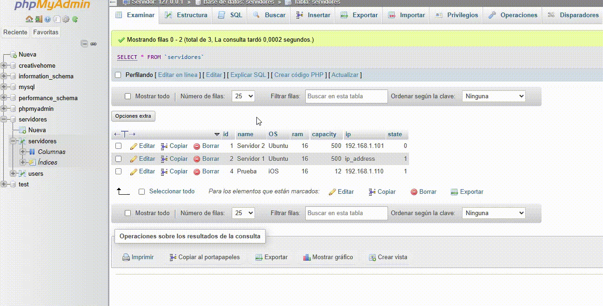

# Proyecto: Gestión de Servidores

## Descripción

Este proyecto es una aplicación web para la gestión de servidores, permitiendo visualizar, agregar, editar y eliminar servidores, además de ver estadísticas sobre su distribución por sistema operativo.

El sistema está compuesto por un backend en Flask y un frontend en Angular.

## Arquitectura del Proyecto

### Backend (API con Flask)

- **Framework:** Flask
- **Base de datos:** MySQL (usando SQLAlchemy como ORM)
- **Rutas principales:**

  - `GET /servers/` → Lista todos los servidores
  - `POST /servers/` → Agrega un nuevo servidor
  - `GET /servers/<id>` → Obtiene detalles de un servidor específico
  - `POST /servers/<id>` → Edita información de un servidor
  - `GET /servers/<id>` → Elimina un servidor
  - `POST /servers/<id>/status` → Cambia el estado de un servidor

### Frontend (Angular 18 - Standalone)

Servicios HTTP con HttpClient para consumir la API

Angular Material para mejorar la interfaz de usuario

Componentes principales:

HeaderComponent: Contiene el título y navegación

LoginComponent: Formulario de autenticación

DashboardComponent: Muestra estadísticas y lista de servidores

ServerListComponent: Tabla con los servidores

ServerStatsComponent: Estadísticas de servidores por OS

Se mejoró la usabilidad con estilos modernos y responsivos.

## Instalación y Ejecución

Backend (Flask)

cd API
pip install -r requirements.txt
flask run

Frontend (Angular)

cd FRONTEND/frontend
npm install
ng serve

Próximos Pasos

Agregar autenticación JWT en el backend

Implementar gráficos interactivos con Angular Material

## Vista Previa del Proyecto

 Desarrollado por Daniel Pineda
